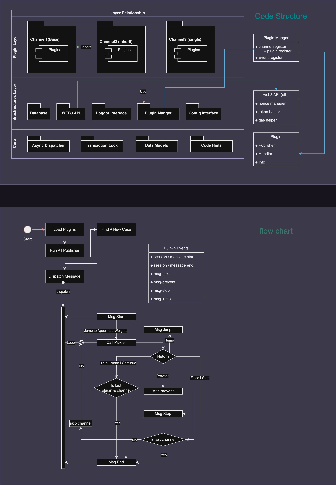

# web3-reactor


## 项目介绍

本项目是一个基于Python的异步web3信息处理套件，内置集成一些常用的区块链基础功能。旨在收集，处理，响应区块链上的所有
Transaction 或 Event。

## 联系我

需要帮助，需要更深度的定制开发，欢迎联系我。  
e-mail: [majoson@qq.com](mailto:majoson@qq.com?subject=web3_reactor-support)  
如果本项目帮助到了你，你可以[捐赠我](./assert/coffee_alipay.jpg)

## 用途

包括但不限于

- NFT抢购
- ERC20抢购
- MEV机器人
- 构建区块链数据库
- 区块链实时数据分析

## 项目结构



## 核心观念

正如名字那样，本项目的核心就在于 `react`，即消息驱动式，一个 `message` 引导一次回应。  
本套件使用插件模式进行开发，开发者可以在本套件提供的基础设施的基础上，开发自己的插件，以实现自己的业务逻辑。

- 消息：一个消息代表了一次广播，消息由频道内的 `publisher` 发布，随后在频道内进行广播。
- 上下文(`msg-context`)：一个消息将会伴随着一个上下文，上下文中包含了消息的一些基础信息，如：区块链原始交易信息，插件自定义的数据等，一个上下文将会在一个完整的生命周期中保持。
- 服务：本套件提供的一些基础服务设施。可以通过开发独立的包，来扩展本套件的服务(目前只提供ETH相关服务)。
- 频道：一个插件的集合，用户开发的对象，可以同时运行多个频道，来执行不同的任务，也可以将频道进行串联关联来执行其中的插件。
- 插件：一个频道中的最小单元，当一个频道广播一个消息时，频道内的插件会根据自己的权重按序处理消息，处理完成后，将消息传递给下一个插件。
- 生命周期：一个消息拥有一个完整的生命周期，包含 `msg-start`, `msg-end`, `msg-prevent`， `msg-stop`, `msg-jump`
  以及开发者自定义的`生命周期事件`，通常地，认为一个完整的生命周期是 `msg-start` 到 `msg-end`。
- 事件：事件是除了默认广播之外的另外一种监听方式，可以用来处理一些特殊的业务逻辑，如：添加后台任务，检查任务情况，清理内存等。事件支持自定义。

### 消息广播

当 `channel` 内的 `publisher` 发布一个消息时，消息将会在 `channel`
内广播，所有的插件都将会收到这个消息，并对其作出相应的回应。  
当本 `channel` 的最后一个插件响应之后，如果 `channel`
没有子节点，那么消息将会被销毁，否则，消息将会被传递给子节点的 `publisher`，并在子节点内广播。  
如果 `channel` 拥有多个子节点，那么 `msg-context` 会被复制，让所有子节点并发执行。

### TODO

- [ ] `msg-context` to lock
- [ ] config format&type check support
- [ ] config .env support
- [ ] etherscan API to module
- [ ] alchemy API to module
- [ ] web3 toolkit (pro edition)
- [ ] 常用合约内置
- [ ] background task api (multi-process)
- [ ] database toolkit
  - [ ] sqlalchemy types
  - [ ] sqlalchemy models

## 快速上手

当一个 `message` 被发布，插件将会按序执行，并对其作出相应的回应。这就是本套件最直观的行为。  
现在，我们将编写一个简单的插件，来实现一个简单的功能：监听 `Transfer` 事件，当事件发生时，打印出 `from` 和 `to` 地址。

### 创建虚拟环境，可选

```shell
python3 -m venv my-reactor
cd my-reactor

# Linux & Mac
source ./venv/bin/activate

# Windows
.\venv\Scripts\activate.bat

```

### 安装

```shell
# Linux & Mac
pip3 install web3-reactor

# Windows
pip install web3-reactor
```

### 使用

详见 [example](./example)
